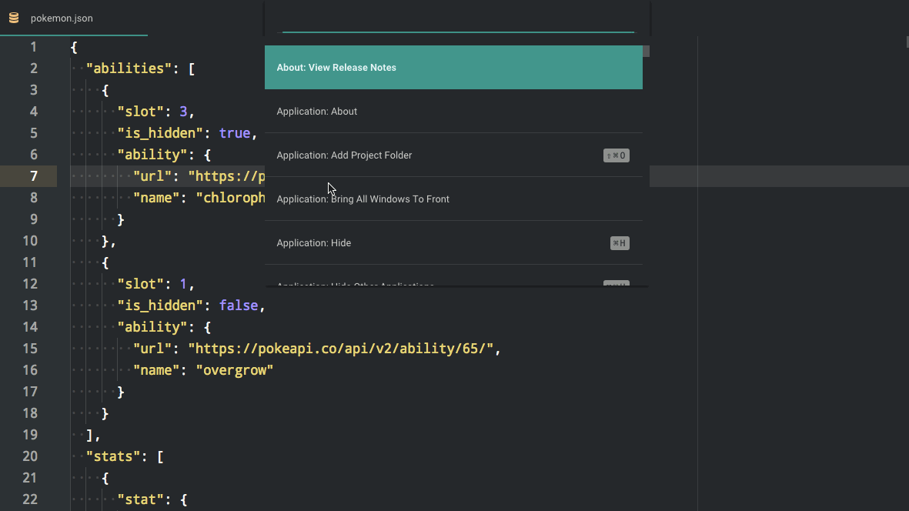

# atom-jq

A playground for jq inside atom

<p align="center">
  <a href="http://standardjs.com/"></a>
  <a href="https://gitter.im/sanack/atom-jq"></a>
</p>

---

### Run jq inside atom



> UI Theme: [Atom Material](https://atom.io/themes/atom-material-ui)
Syntax Theme: [Flatland](https://atom.io/themes/flatland)

## Install

```bash
apm install atom-jq
```
or search '**atom-jq**' in `Setings > Packages`.
